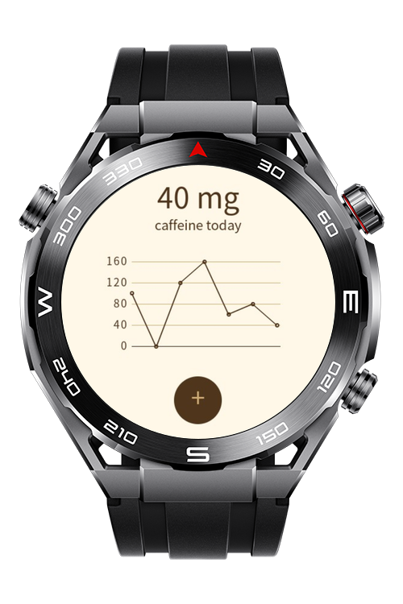
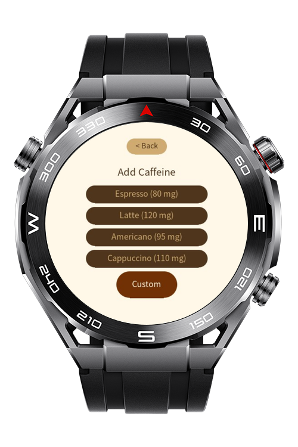
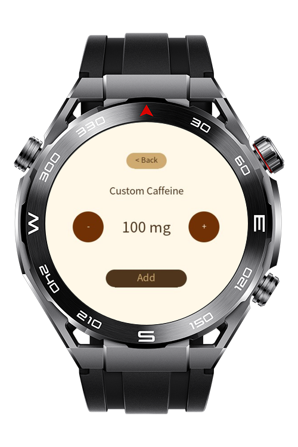

> **Note:** To access all shared projects, get information about environment setup, and view other guides, please visit [Explore-In-HMOS-Wearable Index](https://github.com/Explore-In-HMOS-Wearable/hmos-index).

# Sport Watch - Coffee Tracker

**Coffee Tracker** is a HarmonyOS wearable sample application for Huawei sport watches. The app allows user to track their caffeine usage.
# Preview
<p align="left">
    
    
    
</p>

# Use Cases

Tracking daily caffeine usage
# Technology Stack
**Languages**: ArkTS, ArkUI  
**Frameworks**: HarmonyOS SDK 5.0.0(12)
**Tools**: DevEco Studio 6.0.0  
**Libraries/Kits**:
- @ohos.router
- @system.storage

# Directory Structure
```
entry\src\main\js
└───MainAbility
    │   app.js
    ├───common
    │   └───utils
    │           storageManager.js
    └───pages
        ├───addCaffeine
        │       addCaffeine.css
        │       addCaffeine.hml
        │       addCaffeine.js
        ├───customCaffeine
        │       customCaffeine.css
        │       customCaffeine.hml
        │       customCaffeine.js
        └───index
                index.css
                index.hml
                index.js
```


# Constraints and Restrictions

## Supported Device
- Huawei Sport (Lite) Watch GT 4/5/6
- Huawei Sport (Lite) GT4/5 Pro
- Huawei Sport (Lite) Fit 3/4
- Huawei Sport (Lite) D2
- Huawei Sport (Lite) Ultimate

# License

**Coffee Tracker** is distributed under the terms of the **MIT License**.  
See the [LICENSE](LICENSE) file for more information.  